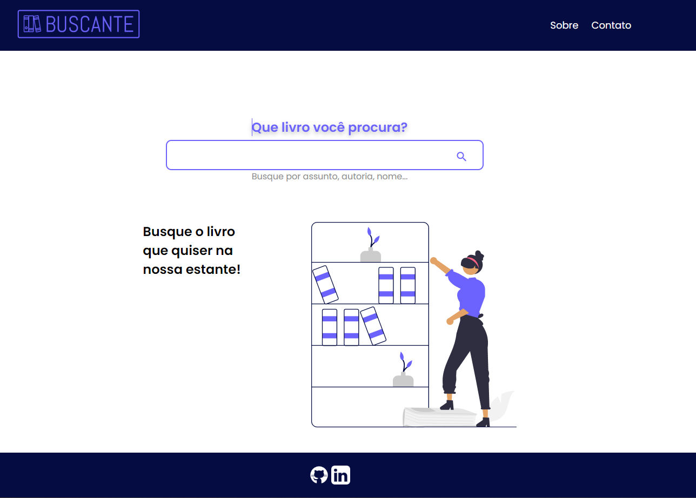
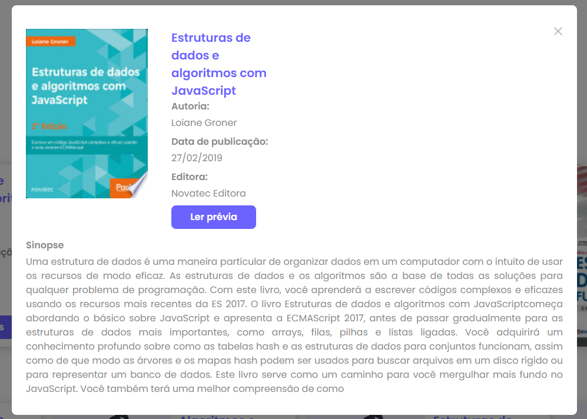

# Buscante

Este projeto foi feito com [Angular CLI](https://github.com/angular/angular-cli) versão 14.0.3.
A aplicação tem o objetivo de fazer pesquisar de livros através da API do [Google Books](https://developers.google.com/books?hl=pt-br).

# Telas
Tela inicial:

Tela de busca:

Modal de detalhes do livro:

# Projeto em produção
O deploy do projeto foi feito através do firebase e pode ser acessado [clicando aqui](https://busca-livros-b207e.web.app/lista-livros)

# Tecnologias do angular usadas:
 - RxJS
 - Pipes
 - Reactive Forms
 - Consumo de API externa

